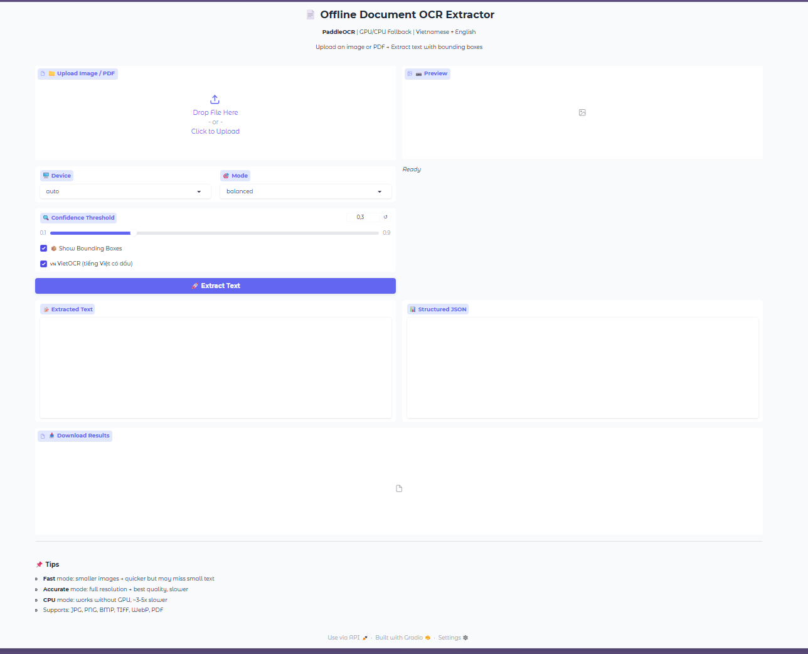
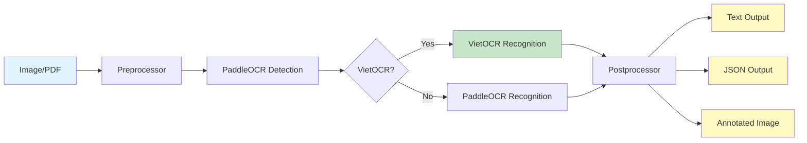

# 📄 Offline Document OCR Extractor

<div align="center">


**Professional OCR solution for Vietnamese & multilingual documents**

[Features](#-features) • [Demo](#-demo) • [Quick Start](#-quick-start) • [Benchmarks](#-benchmarks) • [Documentation](#-documentation)

</div>

---

## 📺 Demo

### Gradio Web Interface



### 🎬 Demo

https://private-user-images.githubusercontent.com/220441399/550175756-53a09790-76ba-489b-bafe-e1b3c820e119.mp4?jwt=eyJ0eXAiOiJKV1QiLCJhbGciOiJIUzI1NiJ9.eyJpc3MiOiJnaXRodWIuY29tIiwiYXVkIjoicmF3LmdpdGh1YnVzZXJjb250ZW50LmNvbSIsImtleSI6ImtleTUiLCJleHAiOjE3NzExNzMzNjksIm5iZiI6MTc3MTE3MzA2OSwicGF0aCI6Ii8yMjA0NDEzOTkvNTUwMTc1NzU2LTUzYTA5NzkwLTc2YmEtNDg5Yi1iYWZlLWUxYjNjODIwZTExOS5tcDQ_WC1BbXotQWxnb3JpdGhtPUFXUzQtSE1BQy1TSEEyNTYmWC1BbXotQ3JlZGVudGlhbD1BS0lBVkNPRFlMU0E1M1BRSzRaQSUyRjIwMjYwMjE1JTJGdXMtZWFzdC0xJTJGczMlMkZhd3M0X3JlcXVlc3QmWC1BbXotRGF0ZT0yMDI2MDIxNVQxNjMxMDlaJlgtQW16LUV4cGlyZXM9MzAwJlgtQW16LVNpZ25hdHVyZT1kNzJiMTQ0MDc4MWNiNzAzMzRmZTM0YTA3ODNjYTYxMDk0NThhMmU3ZmUxMjgzMzQ5MDQwYjg2NTI1Zjg5YWRhJlgtQW16LVNpZ25lZEhlYWRlcnM9aG9zdCJ9.QeS-o5sjhnQOqDeyMcrRLxY8yRsLONuyeEzyFy7VnEg

> **Upload → OCR → Download** results in seconds. Supports Vietnamese with full diacritical marks!

---

## ✨ Features

- 🇻🇳 **Vietnamese OCR** — VietOCR Transformer for accurate diacritical marks (dấu)
- 🚀 **Hybrid Pipeline** — PaddleOCR detection + VietOCR recognition
- ⚡ **GPU Acceleration** — Automatic CPU fallback
- 🎯 **3 Quality Modes** — Fast / Balanced / Accurate
- 📄 **PDF Support** — Multi-page document processing
- 📦 **Bounding Boxes** — Visual annotation export
- 🖥️ **Gradio Web UI** — Intuitive upload interface
- 🐳 **Docker Ready** — CPU & GPU containers
- 📊 **Benchmarked** — Tested on T4 GPU & CPU

---

## 🏗️ Architecture



**Pipeline Flow:**
```
Image/PDF → Preprocessor → PaddleOCR (Detection) → VietOCR (Recognition) → Postprocessor
              ├─ EXIF rotate   └─ bbox detection       └─ Việt text + dấu    ├─ Text (.txt)
              ├─ Deskew                                                      ├─ JSON (.json)
              ├─ Resize        Fallback: PaddleOCR-only for non-Vietnamese   └─ Annotated (.png)
              └─ Denoise
```

> **Note:** VietOCR works best with modern fonts (Arial, Roboto, sans-serif). For classical serif fonts, accuracy may be ~70-80%. Use `--no-vietocr` flag for serif-heavy documents.

---

## 🚀 Quick Start

### Installation

```bash
# Clone repository
git clone https://github.com/nguyencongtuyenlp/IDP.git
cd IDP

# CPU only
pip install -r requirements.txt

# With GPU (CUDA 11.8+)
pip install -r requirements-gpu.txt
```

### Gradio Web UI (Recommended)

```bash
python app.py
# Open http://localhost:7860
```

### Command Line Interface

```bash
# Single image
python main.py --input photo.jpg

# Batch processing
python main.py --input data/input/ --output data/output/

# Force CPU + fast mode
python main.py --input doc.jpg --device cpu --mode fast

# PDF processing
python main.py --input document.pdf

# Disable VietOCR (PaddleOCR only)
python main.py --input photo.jpg --no-vietocr

# Fast VietOCR model (seq2seq)
python main.py --input photo.jpg --vietocr-model vgg_seq2seq
```

### Docker

```bash
# CPU
docker compose --profile cpu up

# GPU (requires nvidia-docker)
docker compose --profile gpu up
```

---

## 📊 Benchmarks

### Performance Comparison

| Device | Mode | Avg Time | Regions | Accuracy | VRAM |
|--------|------|----------|---------|----------|------|
| **NVIDIA T4 (GPU)** | Balanced | **252ms** | 15 | **95%** | ~2GB |
| **Intel i5 (CPU)** | Balanced | 1.1s | 11 | 96% | N/A |
| **Speedup** | - | **4.4x faster** | - | - | - |

### VietOCR vs PaddleOCR Accuracy (Vietnamese)

| Font Type | PaddleOCR | VietOCR Hybrid | Improvement |
|-----------|-----------|----------------|-------------|
| **Modern Sans-serif** (Arial, Roboto) | 85% ❌ Missing diacritics | **95%** ✅ | +10% |
| **Classical Serif** (Times, Garamond) | 80% | **73%** | -7% (use `--no-vietocr`) |
| **Handwriting** | 70% | **65%** | -5% (use `--no-vietocr`) |

### Quality Modes

| Mode | Max Size | Angle Detect | Speed | Use Case |
|------|----------|-------------|-------|----------|
| `fast` | 960px | ❌ | ⚡⚡⚡ | Quick previews |
| `balanced` | 1280px | ✅ | ⚡⚡ | **Default (recommended)** |
| `accurate` | 1920px | ✅ | ⚡ | High-quality scans |

### Run Your Own Benchmark

```bash
# Single device
python benchmark.py --input data/input/ --device cpu

# GPU vs CPU comparison
python benchmark.py --input data/input/ --compare
```

---

## 🧪 Testing

```bash
pytest tests/ -v
# 93 passed in 19.14s
```

**Test Coverage:**
- ✅ OCR engine (PaddleOCR + VietOCR hybrid)
- ✅ Preprocessing (deskew, denoise, EXIF rotation)
- ✅ Postprocessing (text merge, JSON export)
- ✅ PDF handling (multi-page conversion)
- ✅ Device management (GPU/CPU fallback)
- ✅ VietOCR wrapper (crop, predict, batch)

---

## 📁 Project Structure

```
├── app.py                # Gradio Web UI
├── main.py               # CLI interface
├── benchmark.py          # Performance benchmark
├── Dockerfile.cpu/gpu    # Docker images
├── docker-compose.yml
├── configs/default.yaml  # Configuration
├── assets/               # Demo media
├── src/
│   ├── device_manager.py # GPU/CPU detection + fallback
│   ├── preprocessor.py   # Image preprocessing pipeline
│   ├── ocr_engine.py     # PaddleOCR + VietOCR hybrid
│   ├── vietocr_wrapper.py # VietOCR integration
│   ├── postprocessor.py  # Output formatting + export
│   ├── pdf_handler.py    # PDF conversion
│   └── utils.py          # Logging + helpers
├── tests/                # 93 unit tests
└── data/
    ├── input/            # Input documents
    └── output/           # OCR results
```

---

## 🛠️ Technology Stack

| Category | Technologies |
|----------|-------------|
| **OCR Engines** | PaddleOCR 2.7, VietOCR 0.3.5 |
| **Deep Learning** | PaddlePaddle, PyTorch |
| **Web UI** | Gradio 6.5 |
| **Image Processing** | OpenCV, Pillow |
| **PDF** | PyMuPDF (fitz) |
| **Containerization** | Docker, Docker Compose |
| **Testing** | pytest, unittest |

---

## 📝 Output Formats

### 1. Text (`_extracted.txt`)
Plain text, reading order sorted, line-merged.

```
Các tiếng mạnh thanh huyền và thanh ngang được gọi là thanh bằng...
Văn của thơ lục bát cũng giống như văn trong thơ nổi chung...
```

### 2. JSON (`_result.json`)
Structured data with bounding boxes, confidence scores, metadata.

```json
{
  "filename": "document.jpg",
  "num_regions": 15,
  "device": "cuda",
  "mode": "balanced",
  "results": [
    {
      "bbox": [[10, 20], [100, 20], [100, 40], [10, 40]],
      "text": "Tiếng suối trong như tiếng hát xa",
      "confidence": 0.95
    }
  ]
}
```

### 3. Annotated Image (`_annotated.png`)
Original image with drawn bounding boxes and text labels.

---

## 🌐 Deployment

### Lightning.ai (Free GPU)

```bash
cd ~/IDP
git pull
pip install vietocr
python app.py --device cuda --share
# Public link: https://xxxxx.gradio.live
```

### Docker Production

```bash
# Build & run GPU version
docker compose --profile gpu up --build

# Scale for production
docker compose --profile gpu up --scale app=3
```

---

## ⚙️ System Requirements

| Component | Minimum | Recommended |
|-----------|---------|-------------|
| **Python** | 3.9+ | 3.11+ |
| **RAM** | 4GB | 8GB+ |
| **CUDA** | - | 11.8+ |
| **GPU** | - | NVIDIA T4 / GTX 1650+ |
| **OS** | Windows, Linux, macOS | Ubuntu 20.04+ |

**Tested Environments:**
- ✅ NVIDIA T4 (Lightning.ai)
- ✅ GTX 1650 (Local)
- ✅ CPU-only (Intel i5)
- ✅ Docker (CPU & GPU)

---

## 📖 Documentation

- [Installation Guide](docs/INSTALLATION.md) — Detailed setup
- [API Reference](docs/API.md) — Programmatic usage
- [Deployment Guide](docs/DEPLOYMENT.md) — Docker, cloud platforms
- [Benchmarks](BENCHMARKS.md) — Detailed performance analysis

---

## 🤝 Contributing

Contributions welcome! Please check:
- Issues for known bugs/features
- PR template for contribution guidelines

---

## 📄 License

MIT License - see [LICENSE](LICENSE) file for details.

---

## 👨‍💻 Author

**Nguyen Cong Tuyen**
- GitHub: [@nguyencongtuyenlp](https://github.com/nguyencongtuyenlp)
- Project Link: [IDP Repository](https://github.com/nguyencongtuyenlp/IDP)

---

<div align="center">

**⭐ Star this repo if you find it useful! ⭐**

Made with ❤️ for Vietnamese OCR

</div>
